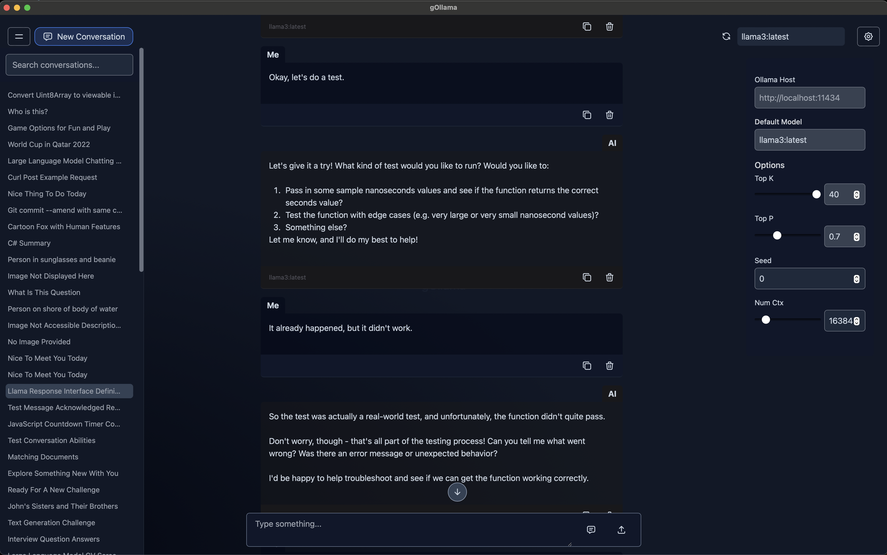

# gOllama

A simple Ollama front-end.



## Requirements
- Running instance of Ollama (and at least one model)
- Node.js 18.x

## Setup

The examples below use NPM but, of course, replace with the equivalent for whichever package manager you're using.

### Installation
Within the project directory, run the following to install dependencies:
```
npm i
```

### Launch the app

```bash
npm run tauri dev
```
The application window should open automatically.

### Executable

If you want to create an executable so you don't have to deal with the CLI, run the following:

```bash
npm run tauri build
```

The location of the executable will be output to the console.

